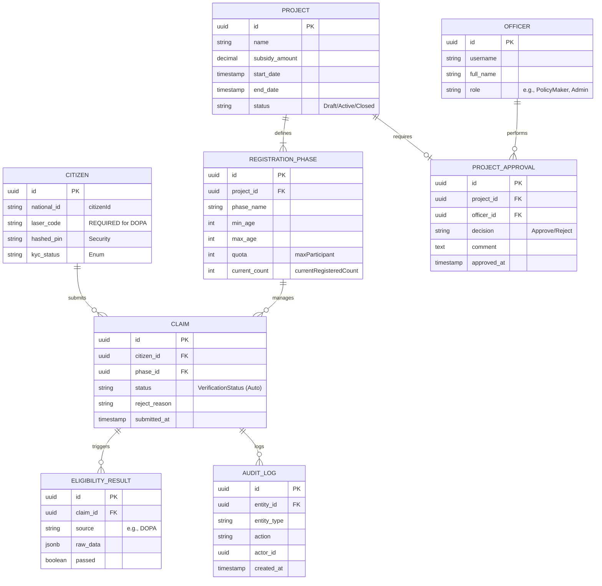

```mermaid
erDiagram
    CITIZEN ||--o{ CLAIM : "submits"
    PROJECT ||--|{ REGISTRATION_PHASE : "defines"
    PROJECT ||--o| PROJECT_APPROVAL : "requires"
    REGISTRATION_PHASE ||--o{ CLAIM : "manages"
    CLAIM ||--o{ ELIGIBILITY_RESULT : "triggers"
    CLAIM ||--o{ AUDIT_LOG : "logs"
    OFFICER ||--o{ PROJECT_APPROVAL : "performs"

    CITIZEN {
        uuid id PK
        string national_id "citizenId"
        string laser_code "REQUIRED for DOPA"
        string hashed_pin "Security"
        string kyc_status "Enum"
    }

    PROJECT {
        uuid id PK
        string name
        decimal subsidy_amount
        timestamp start_date
        timestamp end_date
        string status "Draft/Active/Closed"
    }

    PROJECT_APPROVAL {
        uuid id PK
        uuid project_id FK
        uuid officer_id FK
        string decision "Approve/Reject"
        text comment
        timestamp approved_at
    }

    REGISTRATION_PHASE {
        uuid id PK
        uuid project_id FK
        string phase_name
        int min_age
        int max_age
        int quota "maxParticipant"
        int current_count "currentRegisteredCount"
    }

    CLAIM {
        uuid id PK
        uuid citizen_id FK
        uuid phase_id FK
        string status "VerificationStatus (Auto)"
        string reject_reason
        timestamp submitted_at
    }

    ELIGIBILITY_RESULT {
        uuid id PK
        uuid claim_id FK
        string source "e.g., DOPA"
        jsonb raw_data
        boolean passed
    }
    
    AUDIT_LOG {
        uuid id PK
        uuid entity_id FK
        string entity_type
        string action
        uuid actor_id
        timestamp created_at
    }

    OFFICER {
        uuid id PK
        string username
        string full_name
        string role "e.g., PolicyMaker, Admin"
    }
```