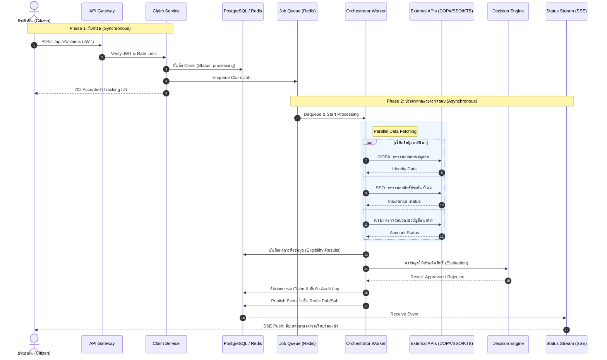

```mermaid
sequenceDiagram
    autonumber
    actor Citizen as ประชาชน (Citizen)
    participant GW as API Gateway
    participant CS as Claim Service
    participant DB as PostgreSQL / Redis
    participant Q as Job Queue (Redis)
    participant W as Orchestrator Worker
    participant EXT as External APIs (DOPA/SSO/KTB)
    participant DE as Decision Engine
    participant SS as Status Stream (SSE)

    Note over Citizen, CS: Phase 1: รับคำขอ (Synchronous)
    Citizen->>GW: POST /api/v1/claims (JWT)
    GW->>CS: Verify JWT & Rate Limit
    CS->>DB: บันทึก Claim (Status: processing)
    CS->>Q: Enqueue Claim Job
    CS-->>Citizen: 202 Accepted (Tracking ID)

    Note over Q, SS: Phase 2: ประมวลผลและตรวจสอบ (Asynchronous)
    Q->>W: Dequeue & Start Processing
    
    rect rgb(240, 248, 255)
    Note right of W: Parallel Data Fetching
    par เรียกข้อมูลภายนอก
        W->>EXT: DOPA: ตรวจสอบสถานะบุคคล
        EXT-->>W: Identity Data
    and
        W->>EXT: SSO: ตรวจสอบสิทธิ์ประกันสังคม
        EXT-->>W: Insurance Status
    and
        W->>EXT: KTB: ตรวจสอบสถานะบัญชีธนาคาร
        EXT-->>W: Account Status
    end
    end

    W->>DB: บันทึกผลการดึงข้อมูล (Eligibility Results)
    
    W->>DE: ส่งข้อมูลให้ประเมินสิทธิ์ (Evaluation)
    DE-->>W: Result: Approved / Rejected
    
    W->>DB: อัปเดตสถานะ Claim & บันทึก Audit Log
    
    W->>DB: Publish Event ไปยัง Redis Pub/Sub
    DB-->>SS: Receive Event
    SS-->>Citizen: SSE Push: อัปเดตสถานะคำขอเรียบร้อยแล้ว
```