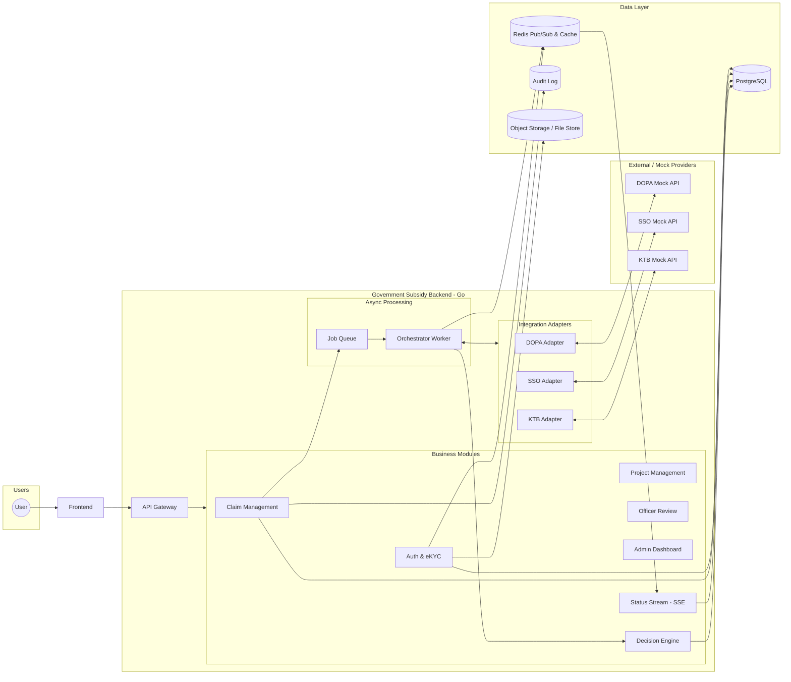

```mermaid
graph LR
    subgraph Users
        User((User))
    end
    User --> Frontend[Frontend]
    Frontend --> APIGateway[API Gateway]
    subgraph Backend [Government Subsidy Backend - Go]
        APIGateway --> BusinessModules
        
        subgraph BusinessModules [Business Modules]
            ClaimMgmt[Claim Management]
            AuthKYC[Auth & eKYC]
            ProjMgmt[Project Management]
            OfficerReview[Officer Review]
            AdminDash[Admin Dashboard]
            StatusStream[Status Stream - SSE]
            DecisionEngine[Decision Engine]
        end
        subgraph AsyncProcessing [Async Processing]
            JobQueue[Job Queue]
            OrchWorker[Orchestrator Worker]
        end
        subgraph IntegrationAdapters [Integration Adapters]
            DOPA_Adp[DOPA Adapter]
            SSO_Adp[SSO Adapter]
            KTB_Adp[KTB Adapter]
        end
        %% Internal Flows (Corrected)
        ClaimMgmt --> JobQueue
        JobQueue --> OrchWorker
        OrchWorker <--> IntegrationAdapters
        OrchWorker --> DecisionEngine
    end
    subgraph ExternalProviders [External / Mock Providers]
        DOPA_Adp <--> DOPA_Mock[DOPA Mock API]
        SSO_Adp <--> SSO_Mock[SSO Mock API]
        KTB_Adp <--> KTB_Mock[KTB Mock API]
    end
    subgraph DataLayer [Data Layer]
        Redis[(Redis Pub/Sub & Cache)]
        Postgres[(PostgreSQL)]
        AuditLog[(Audit Log)]
        ObjectStorage[(Object Storage / File Store)]
    end
    %% Database Connections
    AuthKYC --> Redis
    AuthKYC --> Postgres
    AuthKYC --> ObjectStorage
    
    ClaimMgmt --> Postgres
    ClaimMgmt --> AuditLog
    
    %% Real-time Notification Flow
    OrchWorker --> Redis
    Redis --> StatusStream
    
    StatusStream --> Postgres
    DecisionEngine --> Postgres
```