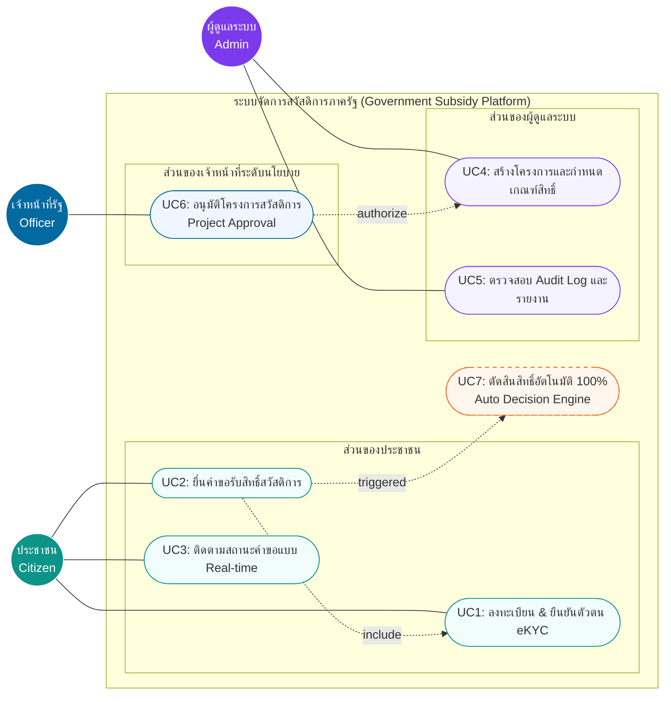

```mermaid
flowchart LR
    %% Actors Definition
    Citizen((ประชาชน<br/>Citizen))
    Officer((เจ้าหน้าที่รัฐ<br/>Officer))
    Admin((ผู้ดูแลระบบ<br/>Admin))

    subgraph Platform["ระบบจัดการสวัสดิการภาครัฐ (Government Subsidy Platform)"]
        %% Citizen Actions
        subgraph Citizen_Actions["ส่วนของประชาชน"]
            UC1(["UC1: ลงทะเบียน & ยืนยันตัวตน eKYC"])
            UC2(["UC2: ยื่นคำขอรับสิทธิ์สวัสดิการ"])
            UC3(["UC3: ติดตามสถานะคำขอแบบ Real-time"])
        end

        %% Admin Actions
        subgraph Admin_Actions["ส่วนของผู้ดูแลระบบ"]
            UC4(["UC4: สร้างโครงการและกำหนดเกณฑ์สิทธิ์"])
            UC5(["UC5: ตรวจสอบ Audit Log และรายงาน"])
        end

        %% Officer Actions
        subgraph Officer_Actions["ส่วนของเจ้าหน้าที่ระดับนโยบาย"]
            UC6(["UC6: อนุมัติโครงการสวัสดิการ<br/>Project Approval"])
        end

        %% Internal System Process
        UC7(["UC7: ตัดสินสิทธิ์อัตโนมัติ 100%<br/>Auto Decision Engine"])
    end

    %% Citizen Connections
    Citizen --- UC1
    Citizen --- UC2
    Citizen --- UC3

    %% Admin Connections
    Admin --- UC4
    Admin --- UC5

    %% Officer Connections
    Officer --- UC6

    %% Logical Relationships
    UC2 -.->|include| UC1
    UC2 -.->|triggered| UC7
    UC6 -.->|authorize| UC4

    %% Styling
    style Citizen fill:#0d9488,stroke:#fff,color:#fff
    style Officer fill:#0369a1,stroke:#fff,color:#fff
    style Admin fill:#7c3aed,stroke:#fff,color:#fff
    
    style UC1 fill:#f0fdfa,stroke:#0d9488
    style UC2 fill:#f0fdfa,stroke:#0d9488
    style UC3 fill:#f0fdfa,stroke:#0d9488
    
    style UC4 fill:#f5f3ff,stroke:#7c3aed
    style UC5 fill:#f5f3ff,stroke:#7c3aed
    
    style UC6 fill:#eff6ff,stroke:#0369a1
    
    style UC7 fill:#fff7ed,stroke:#ea580c,stroke-dasharray: 5 5
```