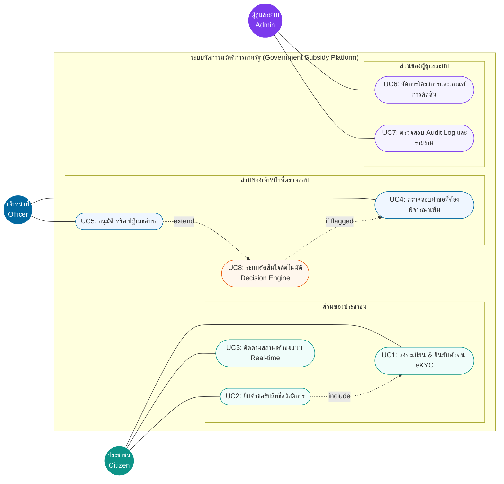

```mermaid
flowchart LR
    %% Actors Definition
    Citizen((ประชาชน<br/>Citizen))
    Officer((เจ้าหน้าที่<br/>Officer))
    Admin((ผู้ดูแลระบบ<br/>Admin))

    subgraph Platform["ระบบจัดการสวัสดิการภาครัฐ (Government Subsidy Platform)"]
        %% Citizen Use Cases
        subgraph Citizen_Actions["ส่วนของประชาชน"]
            UC1([UC1: ลงทะเบียน & ยืนยันตัวตน eKYC])
            UC2([UC2: ยื่นคำขอรับสิทธิ์สวัสดิการ])
            UC3([UC3: ติดตามสถานะคำขอแบบ Real-time])
        end

        %% Officer Use Cases
        subgraph Officer_Actions["ส่วนของเจ้าหน้าที่ตรวจสอบ"]
            UC4([UC4: ตรวจสอบคำขอที่ต้องพิจารณาเพิ่ม])
            UC5([UC5: อนุมัติ หรือ ปฏิเสธคำขอ])
        end

        %% Admin Use Cases
        subgraph Admin_Actions["ส่วนของผู้ดูแลระบบ"]
            UC6([UC6: จัดการโครงการและเกณฑ์การตัดสิน])
            UC7([UC7: ตรวจสอบ Audit Log และรายงาน])
        end

        %% Internal System Use Case
        UC8([UC8: ระบบตัดสินใจอัตโนมัติ<br/>Decision Engine])
    end

    %% Citizen Connections
    Citizen --- UC1
    Citizen --- UC2
    Citizen --- UC3

    %% Officer Connections
    Officer --- UC4
    Officer --- UC5

    %% Admin Connections
    Admin --- UC6
    Admin --- UC7

    %% Logical Relationships
    UC2 -.->|include| UC1
    UC8 -.->|if flagged| UC4
    UC5 -.->|extend| UC8

    %% Styling
    style Citizen fill:#0d9488,stroke:#fff,color:#fff
    style Officer fill:#0369a1,stroke:#fff,color:#fff
    style Admin fill:#7c3aed,stroke:#fff,color:#fff
    
    style UC1 fill:#f0fdfa,stroke:#0d9488
    style UC2 fill:#f0fdfa,stroke:#0d9488
    style UC3 fill:#f0fdfa,stroke:#0d9488
    
    style UC4 fill:#eff6ff,stroke:#0369a1
    style UC5 fill:#eff6ff,stroke:#0369a1
    
    style UC6 fill:#f5f3ff,stroke:#7c3aed
    style UC7 fill:#f5f3ff,stroke:#7c3aed
    
    style UC8 fill:#fff7ed,stroke:#ea580c,stroke-dasharray: 5 5
```